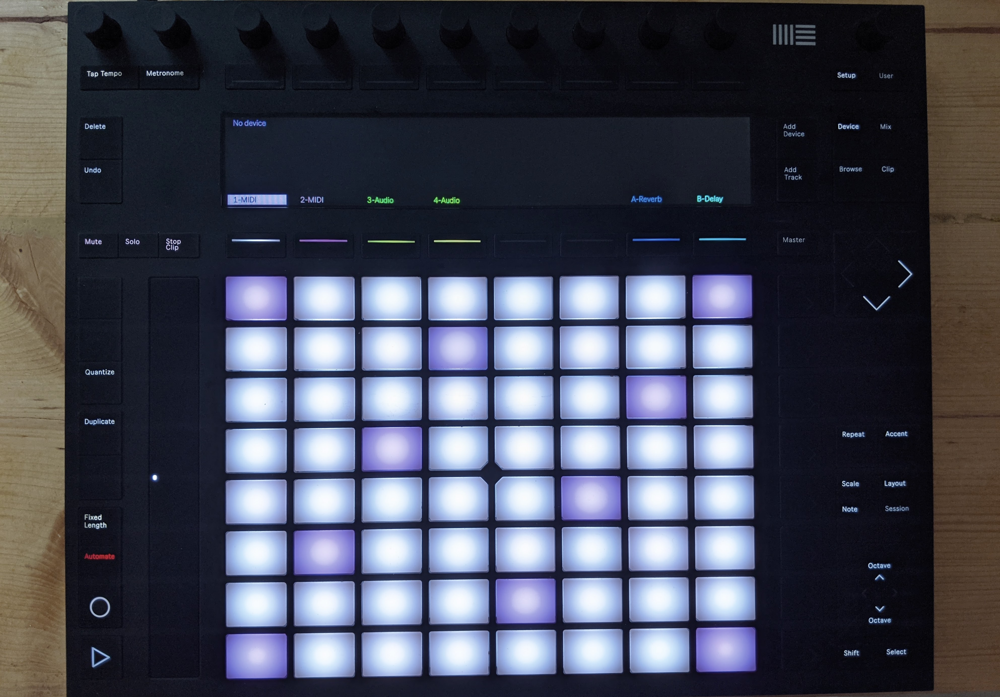

The tutorials will be added one by one over the end months of 2021. I'm assuming that the reader has done the beginner introduction to Ableton Push 2, which involves loading a midi and audio device through the push. That's it, nothing more than that.

In the tutorials I'm hoping to cover the following, some of which are mysterious to me as I write this and hopefully won't be after I've written down what I've learnt:

- What you're not told about Session and Arrangement view in Ableton Live.
- The sequencer and how it represents bars (32, 16 etc).
- Moving about each clip
- The fine art of long button pressing (changing individual notes, adding more bars)
- Run down of each of the many buttons and dials.
- Adding audio filters to a clip
- Sampling
- Chords and keys
- (and more)

## Links

- [Ableton Push 2 manual](https://www.ableton.com/en/manual/using-push-2/)
- [Ableton learn Push videos](https://www.ableton.com/en/push/learn-push/)
- [Ableton Push on Udemy](https://www.udemy.com/course/ableton-push-workflow-and-production/)