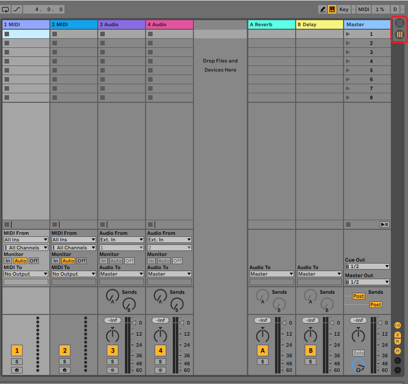
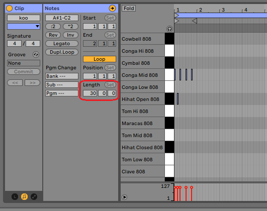
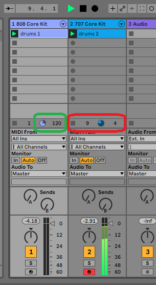

Ableton Push lets you create your songs in view only, Session view. This isn't obvious when you first buy the Ableton Push, from the hardware interface or the manual.

In Ableton Live you toggle between Session and Arrangement View using the 3 lines buttons on the right side:

These two views are described in the Ableton Manual:

- [Arrangement View](https://www.ableton.com/en/manual/arrangement-view/)
- [Session view](https://www.ableton.com/en/manual/session-view/)

The manual goes into some detail, but in summary:

## Arrangement view

This is what you'd be use to coming from Cubase VST, FL Studio, Logic Pro and other DAW studies. Each row is a channel, a new instrument. Left-to-right is the song which columns for each bar.

## Session view

This is special to Ableton. The manual describes it as being special to DJing. Each column represents an instrument or clip, and each row is a different variation. Your filter is locked to the whole column, it's not per clip.

Importantly, you can have one clip playing from one row, and the second, third etc. columns could be playing clips from a different row. Also Ableton handles bringing the next clip into the song in time.

**A row is known as a scene**.

For a DJ set, you could arguably use 2 columns and load them with tracks. Of course this is doesn't account for beat mixing and crossfading. So really it's for live performances of your samples and instrument midi tracks.

You can rename clips, and whole scenes/rows, but only in Ableton Live.

### A note about View-> Mixer

The confusing part to the session/Arrangement view is that the easier-to-use mixer UI is inside the session view. You can disable the mixer in each view, but it's the same mixer.

## Clip length 

Each clip can be as long as you like, it will be looped by Ableton. For a 120bpm track, 30 bars is 1 minute:

- 1 bar is 4 beats (4/4)
- So 30 bars is 120 beats (120bpm)
- aka 1 bar per second
  
You can set the length of the clip in Ableton Live:

## Beats per bar clip length

In Ableton Push, you can display 20 bars maximum. This is the bottom right part. If you double press one of these buttons, it will create a new bar.

(TODO: image of two bars on buttons)

To the left, the coloured buttons are your various instruments. This will be detailed in a future post.

Above the bottom right buttons is the layout of the bar itself. You can change the number of beats displayed in the bar. It defaults to 1/16 - 16 beats. So 4 x 4 columns of beats.

(TODO: image circled of these buttons)

The highest fidelity you can have for this, and in Ableton Live as well, is 1/32 - 8 per beat.

In Ableton Push this will use:

- 1/32 will use all 4 rows. 
- 1/16 will use 2 rows.
- 1/8 will use 1 row.

(TODO: images of each configuration side by side)

### Clip length and current loop count

The number in the green box, which is on the right, is the number of beats in the clip. In this case - 30 bars with 4 beats per bar - so 120.

The red box shows the clip is 4 beats (1 bar), and has looped 9 times already.

